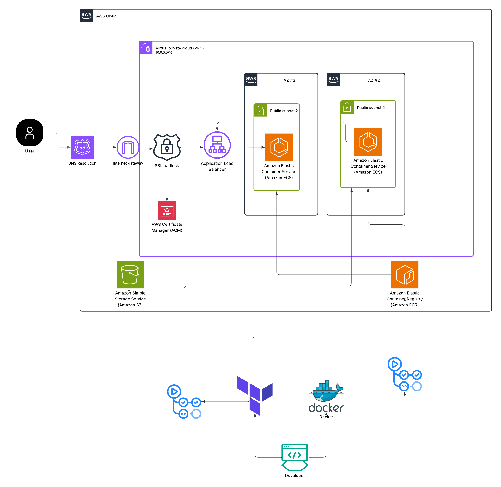
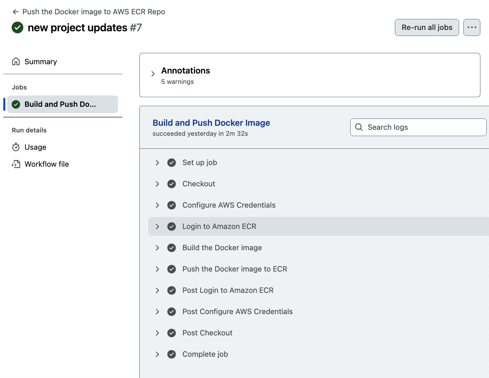
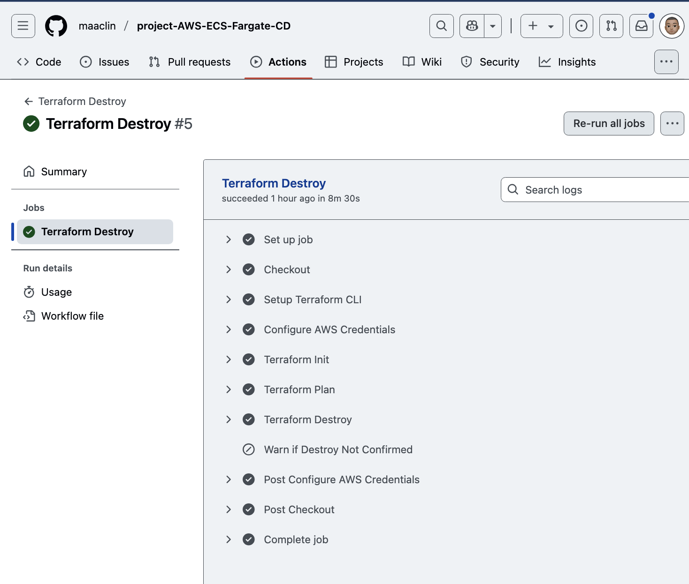
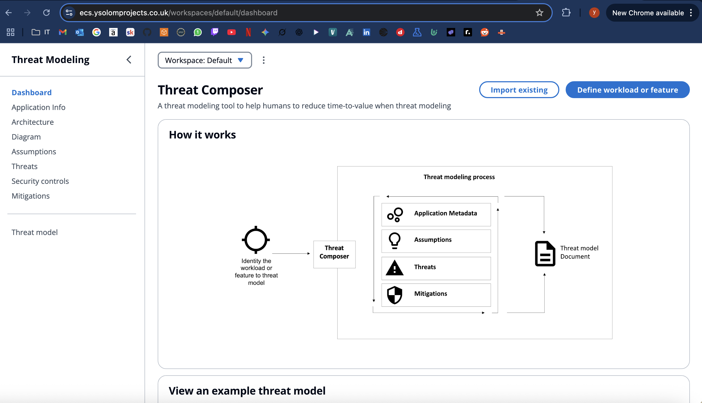

# AWS Threat Composer App - Deployment with Docker & Terraform

--- 

## Introduction

This project demonstrates a streamlined process for deploying a containerised web application to AWS. It leverages Docker for efficient application packaging, GitHub Actions for automated image building and pushing to ECR and Terraform for defining and managing all necessary AWS infrastructure including - ECS, Fargate, ALB and Route53. The goal is to create a highly available web service accessible via my custom domain.



--- 

### Directory Structure 

```
/
├── .github/
│   └── workflows/
│       ├── docker-build.yaml
│       ├── terraform-apply.yaml
│       └── terraform-destroy.yml
├── app/
├── images/
├── terraform/
│   ├── modules/
│   │   ├── alb/
│   │   │   ├── main.tf
│   │   │   ├── outputs.tf
│   │   │   └── variables.tf
│   │   ├── iam/
│   │   │   ├── main.tf
│   │   │   ├── outputs.tf
│   │   │   └── variables.tf
│   │   ├── ecs/
│   │   │   ├── main.tf
│   │   │   ├── outputs.tf
│   │   │   └── variables.tf
│   │   ├── dns/
│   │   │   ├── main.tf
│   │   │   ├── outputs.tf
│   │   │   └── variables.tf
│   │   ├── vpc/
│   │   │  ├── main.tf
│   │   │  ├── outputs.tf
│   │   │  └── variables.tf
│   │   └── acm/
│   │       ├── main.tf
│   │       ├── outputs.tf
│   │       └── variables.tf
│   ├── main.tf
│   ├── outputs.tf
│   ├── providers.tf
│   ├── terraform.tfvars
│   └── variables.tf
├── .gitignore
└── README.md
```
---

### Deployment Workflow 

1. Docker Build

- New changes are pushed to Github
- Workflow builds the image
- Pushes the image to Amazon ECR
- Latest image deployed by ECS 



2. Terraform Plan + Apply 

- New changes are pushed to Github
- Performs an init, plan and apply
- Creates all resources needed for application 


3. Terraform Destroy

- Destroys all resources when triggered using a workflow trigger on Github Actions and "yes" is explicitly passed



--- 

### Final Product - ecs.ysolomprojects.co.uk



---

### Considerations

.dockerignore: Crucial for efficient Docker builds. Files like node_modules and other non-essential artifacts are excluded to keep the Docker image small and build times fast.

.gitignore: The .terraform directory (containing Terraform's state files and plugins) is included in .gitignore to prevent it from being committed to source control, ensuring a clean repository and avoiding potential conflicts with team members.

Understanding resource dependencies is key to successful Terraform deployments and destructions. This causes most issues when deploying an application at production scale.

--- 

### Architecture & Components

The deployment architecture is built upon several key AWS services and components:

#### 1. Docker Image Build
The application is containerised using a multi-stage Dockerfile to optimize image size and build efficiency.

Dockerfile Breakdown:
- Stage 1 (builder): Uses a Node.js base image to install application dependencies (yarn install) and build the static front-end files (yarn build). This results in a /app/build directory containing the application.

- Stage 2 (nginx:alpine): Uses a lightweight Nginx image. It removes default Nginx content and copies the static files from the builder stage into Nginx's web root (/usr/share/nginx/html). The Nginx server is configured to expose port 8080.


#### 2. AWS Infrastructure (Terraform)

All AWS resources are defined and provisioned using Terraform, ensuring IAC and DRY principles are followed. Resources are initially defined in a single file for clarity and then organised into modules for better maintainability and reusability.

- Public Subnets: Subnets within the VPC configured to have direct access to the internet, where public-facing resources like the ALB will be placed.
- Internet Gateway (IGW): Enables communication between the VPC and the internet.
- Route Table & Associations: Defines rules for network traffic
- Application Load Balancer (ALB): Distributes incoming application traffic across our ECS tasks in multiple Availability Zones for high availability and fault tolerance.
- Security Groups: Act as virtual firewalls to control inbound and outbound traffic for both the ALB and the ECS tasks, ensuring only necessary ports are open. The ALB Security Group allows inbound traffic on ports 80 (HTTP) and 443 (HTTPS) from the internet and the ECS Security Group allows inbound traffic on the application's port - only from the ALB's security group.
- Target Group: A logical grouping of targets (our ECS tasks) that the ALB routes traffic to. It should include health checks to ensure traffic is only sent to healthy instances.
- ALB Listener: Configured to listen for incoming connections on specific ports (e.g., 80 and 443) and forward them to the target group based on rules.
- AWS Certificate Manager (ACM): Provides an SSL/TLS certificate to enable HTTPS (secure) communication for our application. ACM provides a CNAME record that must be added to your DNS (Route 53) to validate domain ownership and issue the certificate. This CNAME record is created using Terraform. The ALB Listener is then configured to use this ACM certificate for HTTPS traffic.

#### 3. Container Orchestration (ECS on Fargate)

ECS Cluster: A logical grouping of tasks or services.

- ECS Task Definition: A blueprint for running our Docker containers, specifying the Docker image, CPU, memory, networking mode and other container settings.
- ECS Service: Maintains the desired number of tasks in the cluster, handles deployments, and integrates with the ALB for load balancing.
- Fargate Launch Type: Eliminates the need to manage underlying EC2 instances, as AWS fully manages the compute capacity.
- IAM Roles: Necessary IAM roles are created to allow ECS tasks and the ECS service to interact with other AWS services (e.g., pulling images from ECR, logging to CloudWatch).

#### 4. Domain Name System (Route 53)

Route 53 Hosted Zone: Manages DNS records for ysolomprojects.com (or your chosen domain).

- A Record (Alias): An A record (specifically an Alias record) is created in Route 53 to point your application's CNAME record (ecs.ysolomprojects.com) to the DNS name of the Application Load Balancer. This allows users to access your application via a friendly domain name.

Note: The base domain (ysolomprojects.com) and its initial Hosted Zone need to be created manually in the AWS Console before Terraform runs, as Terraform usually manages records within an existing zone.


### Automation with GitHub Actions

Now, to the backbone of DevOps... CI/CD.

#### Continuous Integration (CI) - Docker Image:

Trigger: On changes to the main branch (or specific Dockerfile/application code paths).

Steps:

```
- Checkout code.
- Login to AWS ECR.
- Build Docker image using the Dockerfile.
- Tag the Docker image (e.g., with Git commit SHA or version).
- Push the tagged image to the ECR repository.
```

#### Continuous Delivery (CD) - Terraform Deployment:

Trigger: This will use a manual trigger to ensure accidental deletion does not occur.

Steps:

```
- Checkout code (including Terraform files).
- Configure AWS credentials (using GitHub Secrets).
- Initialize Terraform (terraform init).
- Plan Terraform changes (terraform plan).
- Apply Terraform changes (terraform apply). 

This will deploy or update your AWS infrastructure based on your .tf files.
```

---

